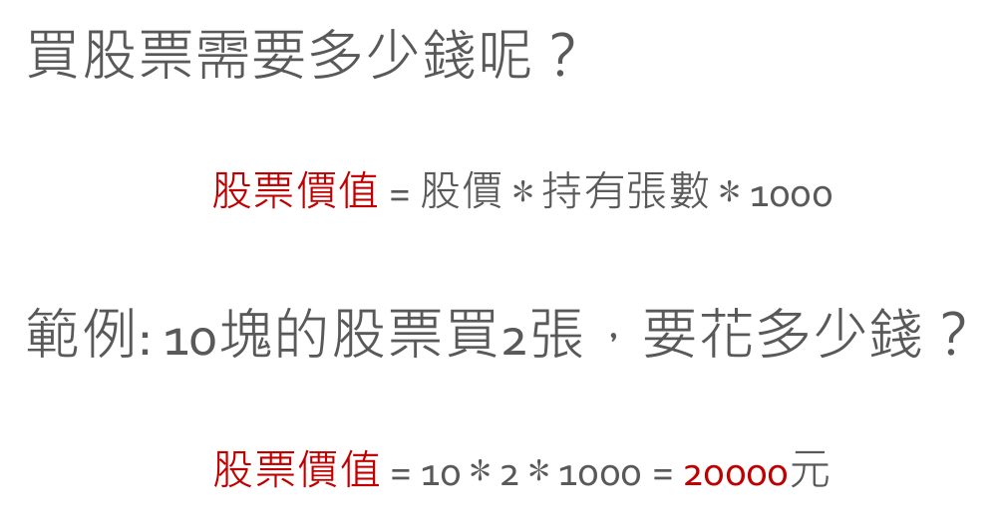
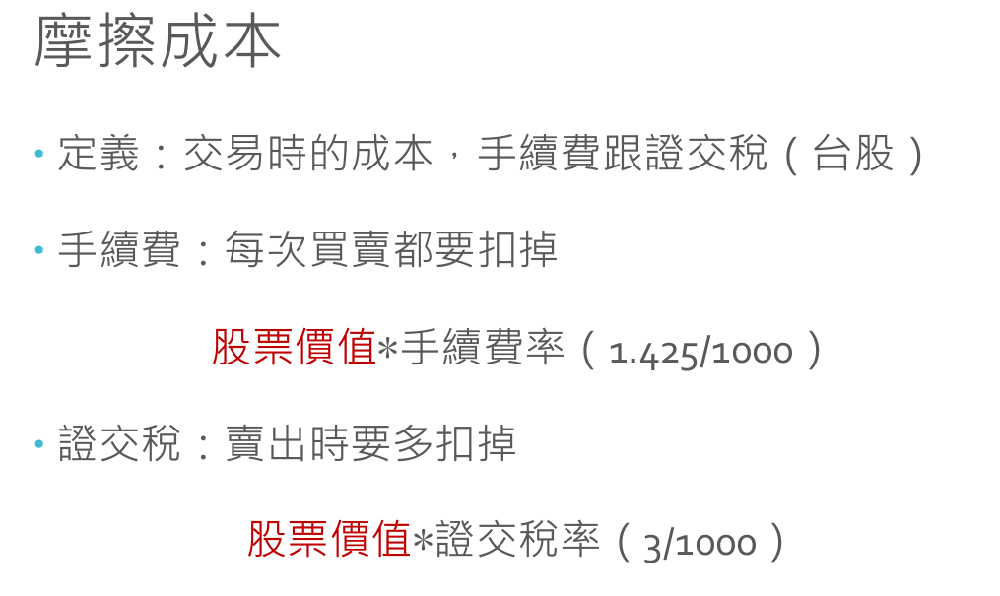

## 財經小知識

**買賣股票需要多少錢?**



**摩擦成本 = 手續費 + 證交稅**



## 習題1

```python
"""
上課習題：

    帳戶有100000元
    
    1. 買一張股價為30的股票
    2. 股價漲了20%
    3. 賣出
    
    請問帳戶現在有多少錢?
"""

account = 100000
stock_price = 30
buy_amount = 1

fee_ratio = 1.425 / 1000
tax_ratio = 3 / 1000

# 買股票，帳戶的錢變少
stock_value = stock_price * buy_amount * 1000
account = account - stock_value - stock_value * fee_ratio

# 股價漲
stock_price *= 1.2

# 賣股票，帳戶的錢變多
stock_value = stock_price * buy_amount * 1000
account = account + stock_value - stock_value * (fee_ratio + tax_ratio)

print(account)
# 105797.95
```

## 習題2

```python
"""
設計一個函數，叫做calculate_earning
這個函數讀入買入價格、賣出價格、持有數量，並回傳獲利。
(不用考慮手續費)
"""

def calculate_earning(buy_price, sell_price, amount=1):
    ret = (sell_price - buy_price) * amount * 1000
    return ret

value = calculate_earning(30, 40, 2)
print(value)
# 20000
```
